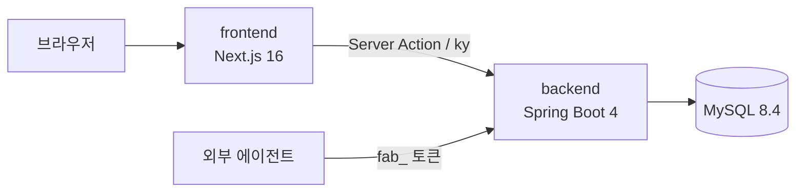

# 우리집 가계부 (fos-accountbook)

가족이 함께 수입과 지출을 기록하고, 월 예산을 관리하는 가계부 웹앱이다.
직접 쓰려고 만들었고 홈서버에서 운영한다.

- 서비스: https://accountbook.fosworld.co.kr
- 프론트엔드와 백엔드를 한 저장소에 둔다(ADR-M01).

## 주요 기능

| 기능 | 내용 |
| --- | --- |
| 로그인 | Google, Naver 소셜 로그인 |
| 가족 | 가족 생성, 초대 링크 발급과 수락, 기본 가족 선택 |
| 달력 홈 | 날짜 칸마다 구성원별 지출을 보여 주고, 날짜를 골라 바로 등록·수정·삭제 |
| 거래 내역 | 지출과 수입의 등록·수정·삭제, 카테고리와 기간 필터 |
| 반복 지출 | 매월 정한 날에 지출을 자동으로 만든다 |
| 카테고리 | 가족별 카테고리, 색상과 아이콘, 예산 제외 설정 |
| 예산 | 월 예산과 진행률, 50·80·100% 도달 알림 |
| 할부 | 할부를 기록하고 회차와 남은 금액을 본다. 예산에는 넣지 않는다 |
| 분석 | 월별 지출 추이, 카테고리별 비중과 전월 대비 변동 |
| 알림 센터 | 예산 알림과 반복 지출 생성 알림, 읽음 처리 |
| 외부 연동 토큰 | AI 에이전트 같은 외부 도구가 가계부 API 를 부를 수 있게 사용자별 토큰을 발급하고 폐기한다 |

## 구성



| 디렉터리 | 내용 | 기술 |
| --- | --- | --- |
| [`frontend/`](frontend/) | 웹 화면과 Server Action | Next.js 16, React 19, TypeScript, Tailwind CSS v4, shadcn/ui, NextAuth v5 |
| [`backend/`](backend/) | REST API (`/api/v1`) | Java 21, Spring Boot 4, Spring Data JPA, QueryDSL, Flyway, MySQL 8.4 |
| [`docs/`](docs/) | 저장소 전체 결정 (ADR-M) | |

## 로컬 실행

도구 버전은 [`.tool-versions`](.tool-versions) 가 정한다(Node 22, pnpm 10, Java 21).

```bash
# 1. MySQL (호스트 포트 13306)
docker compose -f backend/docker/compose.yml up -d

# 2. 백엔드 (http://localhost:8080)
cd backend && ./gradlew bootRun --args='--spring.profiles.active=local'

# 3. 프론트엔드 (http://localhost:3000)
cd frontend && pnpm install && pnpm dev
```

- `gradle-wrapper.jar` 는 추적하지 않는다. 없으면 [CLAUDE.md](CLAUDE.md) 의 명령으로 만든다.
- 프론트엔드 환경 변수는 [`frontend/README.md`](frontend/README.md#환경-변수) 에 있다.
- 프론트엔드와 백엔드의 `AUTH_SECRET` 은 같은 값이어야 한다. 소셜 로그인 결과를 이 값으로 서명해 백엔드에 넘긴다.

## 검증

커밋 전에 바뀐 쪽의 검증을 로컬에서 통과시킨다.

```bash
cd frontend && pnpm lint && pnpm test
cd backend && ./gradlew qualityCheck test
```

## CI와 배포

| 워크플로 | 하는 일 |
| --- | --- |
| `frontend-ci.yml`, `backend-ci.yml` | PR 과 main push 마다 타입 검사, lint, 테스트 |
| `docs-ci.yml` | 문서가 바뀐 PR 에서 ADR 링크 검사 |
| `claude-code-review.yml` | PR 자동 코드 리뷰. 재실행은 `/review` 댓글 |
| `frontend-image.yml`, `backend-image.yml` | main 에 머지되면 이미지를 `ghcr.io/jon890/fos-accountbook-{frontend,backend}` 로 올린다 |

홈서버는 올라간 이미지를 받아 실행한다.
DB 스키마는 백엔드가 시작할 때 Flyway 가 적용한다.

## 기여 규칙

- main 에 직접 push 할 수 없다. 작업 브랜치와 PR 로 바꾼다.
- PR 제목과 커밋 메시지는 `type(scope): 설명` 형식이고, 커밋은 한국어로 쓴다.
- 브랜치 이름, 계획서 작성 흐름, 문서 원칙은 [CLAUDE.md](CLAUDE.md) 가 정한다.

## 문서

| 문서 | 내용 |
| --- | --- |
| [docs/adr/INDEX.md](docs/adr/INDEX.md) | 저장소 전체 결정 (ADR-M) |
| [frontend/docs/](frontend/docs/) | 프론트엔드 요구사항, 흐름, 구조, 결정 (ADR-F) |
| [backend/docs/](backend/docs/) | 백엔드 요구사항, 흐름, 스키마, 결정 (ADR-B) |
