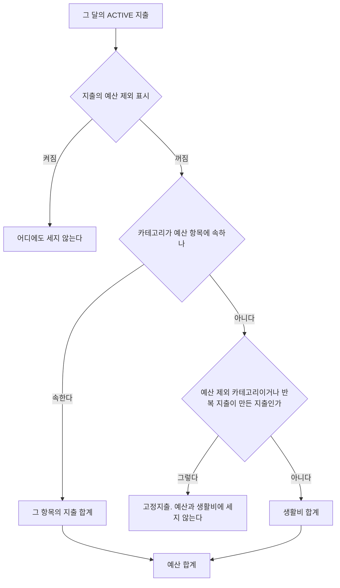

# fos-accountbook-backend 사용자 흐름

> 핵심 사용자 시나리오별 흐름. API 엔드포인트 목록은 `data-schema.md` 참고.

---

## 1. 온보딩 (최초 가입)

```
소셜 로그인 (Google/Naver)
    │
    ▼
POST /auth/social-login → JWT 발급
    │
    ▼
POST /families → 가족 생성
    │  └─ 지출 카테고리 11개와 수입 카테고리 4개 자동 생성
    │     (삭제할 수 없는 기본 카테고리: 지출 미분류, 수입 기타 수입)
    │  └─ UserProfile.defaultFamilyUuid 자동 설정
    │
    ▼
가족 초대 링크 공유 (선택)
    │
    ├─ POST /invitations/families/{uuid} → 초대 링크 생성
    └─ 구성원이 GET /invitations/token/{token} → POST /invitations/accept
```

## 2. 지출 등록 ~ 예산 알림

```
POST /families/{familyUuid}/expenses
    │  body: { categoryUuid, amount, description, date }
    │
    ▼
ExpenseService.create()
    ├─ 카테고리 유효성 검증 (캐시)
    ├─ Expense 엔티티 저장
    └─ ExpenseCreatedEvent 발행
            │
            ▼  (트랜잭션 커밋 후, 비동기)
        BudgetAlertEventListener
            ├─ 월 예산 대비 예산 합계 비율 계산 (예산 합계는 「8. 예산 항목과 예산 요약」)
            ├─ 50% / 80% / 100% 초과 시 Notification 생성
            └─ 실패해도 지출 저장에 영향 없음
```

## 3. 반복 지출 자동 생성

```
사용자: POST /families/{familyUuid}/recurring-expenses
    │  body: { name, categoryUuid, amount, dayOfMonth }
    │
    ▼
RecurringExpense 템플릿 저장 (status=ACTIVE)

        ┌──────────────────────────────┐
        │  매일 KST 새벽 1시 (스케줄러)   │
        │  RecurringExpenseScheduler    │
        └──────────┬───────────────────┘
                   │
                   ▼
        오늘 dayOfMonth인 ACTIVE 템플릿 조회
                   │
                   ▼  (각 템플릿마다)
        템플릿 하나를 트랜잭션 하나로 처리 (RecurringExpenseGenerator)
        (recurring_expense_uuid, year_month) 중복 체크
                   │
            ┌──────┴──────┬──────────────┐
            │ 미생성       │ 이미 존재     │ 예외
            ▼             ▼              ▼
        Expense 생성   log.warn → skip  log.warn → 그 템플릿만 skip, 다음 템플릿 계속
            │
            ▼  (모든 템플릿 처리 뒤 가족마다)
        RecurringExpenseCreatedEvent 발행 (트랜잭션 밖)
            │
            ▼
        가족의 ACTIVE 구성원마다 Notification 생성 (RECURRING_EXPENSE_CREATED, userUuid = 구성원)
```

스케줄러는 트랜잭션 밖에서 이벤트를 발행한다. `@TransactionalEventListener` 는 기본값으로 트랜잭션 밖 이벤트를 버리므로, 이 리스너는 `fallbackExecution = true` 로 받는다.
알림 목록은 `userUuid` 로 조회하므로 수신자를 구성원마다 정해 저장한다. `userUuid` 가 null 인 알림은 아무에게도 보이지 않는다.

## 4. 카테고리 삭제 시 연쇄 처리

```
DELETE /families/{familyUuid}/categories/{categoryUuid}
    │
    ▼
CategoryService.deleteCategory()
    ├─ 기본 카테고리 여부 체크 (is_default=true → 삭제 불가)
    ├─ 종류별 기본 카테고리 조회 (지출: 미분류, 수입: 기타 수입)
    ├─ EXPENSE → 지출 전체 이력과 ACTIVE 반복 지출을 미분류로 이관
    ├─ INCOME → 수입 전체 이력을 기타 수입으로 이관
    ├─ EXPENSE → 예산 항목에서 이 카테고리를 뺀다 (budget_item_categories 행 삭제)
    └─ Category status → DELETED + 캐시 무효화
```

## 5. 대시보드 조회

```
GET /families/{familyUuid}/dashboard/stats/monthly?year=2026&month=4
    │
    ▼
DashboardService.getMonthlyStats()
    ├─ 해당 월 예산 합계 (「8. 예산 항목과 예산 요약」)
    ├─ 해당 월 총 수입
    ├─ 월 예산 대비 비율
    └─ 가족 멤버 수
```

```
GET /families/{familyUuid}/dashboard/stats/monthly-trend?from=2026-01&to=2026-06
    │
    ▼
DashboardService.getMonthlyTrend()
    ├─ GROUP BY YEAR, MONTH로 N개월 지출 합계 집계
    └─ 평균 계산 (데이터 있는 월 기준)
```

```
GET /families/{familyUuid}/dashboard/stats/category-breakdown?year=2026&month=5&compareWithPrev=true
    │
    ▼
DashboardService.getCategoryBreakdown()
    ├─ 월 범위는 [그 달 1일 00:00, 다음 달 1일 00:00) 반열린 구간 (다음 달 1일 00:00 지출은 다음 달)
    ├─ 카테고리별 금액·비율 계산
    └─ compareWithPrev=true 시 전월 조회 → delta 계산, previousAmount(직전 달 지출 없으면 0) 함께 응답
        └─ deltaPercent 는 전월 0원이면 null. previousAmount 로 「비교 안 함」 과 「이번 달 새로 생김」 을 구분한다
```

```
GET /families/{familyUuid}/dashboard/budget-summary?year=2026&month=10
    │
    ▼
DashboardService.getBudgetSummary()
    ├─ 예산: 그 달 예산 합계와 families.monthly_budget
    ├─ 생활비: 그 달 생활비 합계와 monthly_budget 에서 항목 한도 합을 뺀 값 (0 미만이면 0)
    └─ 항목: 가족의 ACTIVE 예산 항목마다 그 항목 카테고리의 그 달 지출 합계와 monthly_limit (만든 순서)
```

## 6. 인증 갱신

```
Access Token 만료 (15분)
    │
    ▼
POST /auth/refresh  body: { refreshToken }
    │
    ├─ typ=refresh 이고 유효 → 새 Access + Refresh Token 발급
    ├─ typ 이 refresh 가 아님 (access token, typ 없는 옛 토큰) → 401 (A002)
    └─ Refresh Token 만료 (7일) → 401 → 재로그인 필요
```

API 인증 필터(`JwtAuthenticationFilter`)는 `typ=access` 인 토큰만 인증한다. refresh token 이나 `typ` 없는 토큰은 인증하지 않아 보호 경로에서 401 이 된다([ADR-B19](adr/ADR-B19-jwt-token-type-claim.md)).

보호 경로에서 인증이 없거나 JWT 가 유효하지 않으면 `ApiErrorResponse` 형식의 401(A002)을 반환한다. 인증된 사용자의 권한 부족은 403 을 유지한다.

---

## 7. 연동 토큰으로 부르기 (외부 에이전트)

```
[발급] 사용자가 설정 화면에서 발급 (JWT)
    POST /users/me/api-tokens { name }
        └─ fab_ + 무작위 32바이트(base64url) 생성 → SHA-256 해시만 저장
        └─ 응답에 원문을 한 번 싣는다. 다시 조회할 수 없다

[호출] 외부 에이전트(fos-assistant 의 Hermes profile 에서 도는 fos-agents 가계부 스킬) → 가계부 백엔드 (외부 공인 경로)
    Authorization: Bearer fab_...
        │
        ▼
    ApiTokenAuthenticationFilter (JWT 필터보다 먼저)
        ├─ fab_ 로 시작하지 않으면 → 다음 필터(JWT)로 넘긴다
        ├─ 해시로 ACTIVE 토큰을 찾지 못하거나 토큰 주인이 ACTIVE 사용자가 아니면 → 401 (A002)
        ├─ 허용 목록 밖 경로면 → 403 (A005)
        └─ 통과 → principal = 토큰 주인 userUuid, 권한 API_TOKEN
                  last_used_at 이 5분 넘게 지났으면 갱신
        │
        ▼
    기존 Controller → Service
        └─ 가족 권한 검증은 로그인과 같은 경로 (validateAndGetFamily, validateFamilyAccess, @ValidateFamilyAccess)

허용 목록 (ADR-B18)
    GET    /families
    GET    /families/{familyUuid}/categories
    GET    POST            /families/{familyUuid}/expenses
    GET    PUT    DELETE   /families/{familyUuid}/expenses/{expenseUuid}
    GET    POST            /families/{familyUuid}/incomes
    GET    PUT    DELETE   /families/{familyUuid}/incomes/{incomeUuid}
```

---

## 8. 예산 항목과 예산 요약

결정 근거는 ADR-B25 와 ADR-B26 이다.



항목 카테고리의 지출 가운데 카테고리가 예산 제외이거나 반복 지출이 만든 것은 항목 합계에는 들어가고 예산 합계에는 들어가지 않는다.

```
POST /families/{familyUuid}/budget-items
    │  body: { name, monthlyLimit, categoryUuids }
    ▼
BudgetItemService.createBudgetItem()
    ├─ 가족 구성원 검증 (@ValidateFamilyAccess)
    ├─ ACTIVE 항목이 이미 10개 → 400 BI003
    ├─ 같은 이름의 ACTIVE 항목 → 409 BI004
    ├─ 카테고리마다 가족 소속과 EXPENSE 종류 검증 → 없으면 404 CT001, 수입 카테고리면 400 CT005
    ├─ 다른 항목에 이미 속한 카테고리 → 409 BI002
    └─ budget_items 와 budget_item_categories 저장
```

- 수정(`PUT`)은 이름과 한도를 바꾸고 카테고리 묶음을 통째로 바꾼다. 검증은 생성과 같고, 자기 항목에 이미 있던 카테고리는 충돌로 보지 않는다.
- 삭제(`DELETE`)는 항목을 `DELETED` 로 바꾸고 `budget_item_categories` 행을 지운다. 그 카테고리의 지출은 다시 생활비에 들어간다.
- 두 사람이 동시에 같은 카테고리를 서로 다른 항목에 넣으면 `uq_budget_item_categories_category` 가 뒤 요청을 막고 409 BI002 로 응답한다.
- 항목이 하나도 없으면 예산 요약의 `items` 는 빈 배열이다. 월 예산이 0 이면 `living.limit` 은 0 이다.

## 도메인 간 이벤트 흐름 요약

| 이벤트                         | 발행자    | 구독자       | 트리거             |
| ------------------------------ | --------- | ------------ | ------------------ |
| `ExpenseCreatedEvent`          | expense   | notification | 지출 등록          |
| `ExpenseUpdatedEvent`          | expense   | notification | 지출 수정          |
| `RecurringExpenseCreatedEvent` | recurring | notification | 스케줄러 자동 생성 |

동기 호출 (향후 이벤트 전환 후보):

- `family → category`: 가족 생성 시 기본 카테고리 생성
- `category → expense/recurring/income`: 카테고리 삭제 시 종류별 기본 카테고리로 이동
- `category → budgetitem`: 카테고리 삭제 시 예산 항목에서 그 카테고리를 뺀다
- `budgetitem → category`: 항목 저장 시 카테고리의 가족 소속과 종류 검증
- `family → user`: 가족 생성 시 기본 가족 설정
